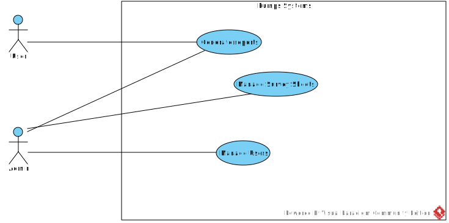

[На русском](https://github.com/ciukstar/pumps/blob/master/README.ru.md)

# Pumps

Create and manage Survey Sheets

## Overview

[Pumps](https://pumps-i4rimw5qwq-de.a.run.app) allows to create and manage survey sheets.


*Use Case Diagram*


## User roles
  
* Data administrator  

  Data administrators have full access to all events and data.


* Superuser  

  * Username  
    ```$YESOD_SUPERUSER_USERNAME```
  * Password  
    ```$YESOD_SUPERUSER_PASSWORD```
  
  A superuser account is defined at deployment time. The superuser manages other users and grants or revokes administrator privileges to specific users.

## Basic entities

*Entity Relationship Diagram*


### Participant
...

### Survey Sheet
...

## Demo

[Click here to see demo](https://pumps-i4rimw5qwq-de.a.run.app)
