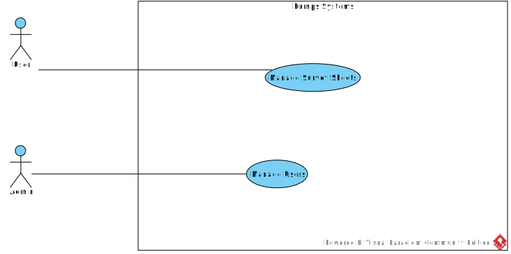
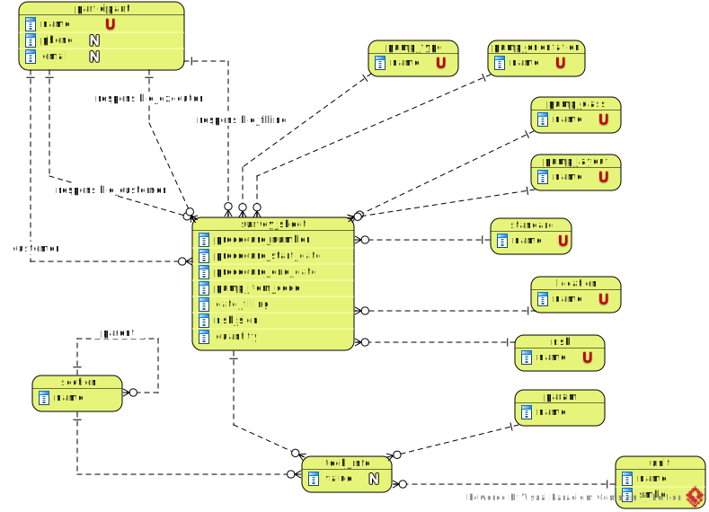

[In english](https://github.com/ciukstar/pumps/blob/master/README.md)

# Насосы

Создание и управление листами опроса

## Насосы

[Pumps](https://pumpsru-i4rimw5qwq-de.a.run.app) позволяет создавать и управлять листами опроса.


*Диаграмма вариантов использования*


## Роли пользователей

* Администратор данных  

  Администраторы данных имеют полный доступ ко всем данным и могут предоставлять или отзывать права администратора другим пользователям.

* Суперпользователь  

  * Имя пользователя  
    ```$YESOD_SUPERUSER_USERNAME```
  * Пароль  
    ```$YESOD_SUPERUSER_PASSWORD```

  Учетная запись суперпользователя определяется во время развертывания. Суперпользователь управляет другими пользователями и предоставляет или отзывает права администратора конкретным пользователям.


## Базовые сущности

*Диаграмма взаимосвязи сущностей*



### Участник
...

### Опросный лист
...

## Демо

[Нажмите здесь, чтобы увидеть демо](https://pumpsru-i4rimw5qwq-de.a.run.app)
